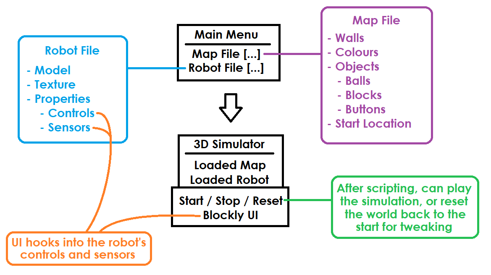

# Features
This page documents what we expect to go into the product. It is split into three sections; minimum viable product, realistic goals and stretch goals.

## Minimum Viable Product
This is a list of features we would need to have a complete product ready in September:
* 2D simulator taking only elements in a horizontal plane in account (walls, lines on ground etc) but rendered in 3D.
* Objects in the simulation, such as blocks, walls and balls.
* Sensors connected to the robot (colour, speed, position etc).
* Fully scripted robot control code.
* Scriptable objects in the world; for example, a ball dispenser.

## Realistic Goals
This is a list of features we could realistically add in the time frame given the MVP:
* Account capabilities such as saving work, work that is viewable by tutors, interation between students etc.
* A tutorial on how to use the system, not how to code.
* Map builder
* Controller based controls such as a virtual joystick.
* Scoreboard

## Stretch Goals
This is a list of nice-to-have features that are less of a priority unless we have a fully working product with all of our realistic goals achieved:
* Full 3D simluation for multiple levels and ramps
