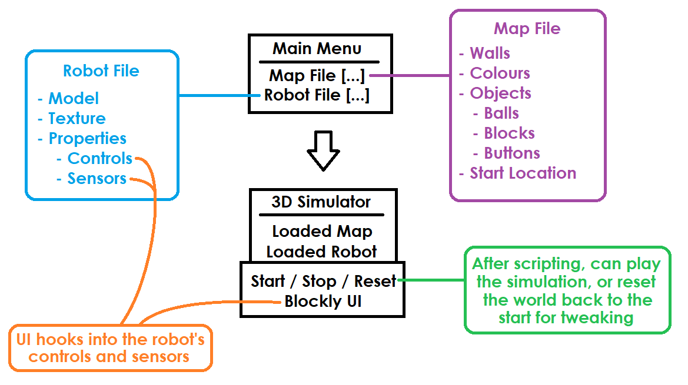

# Project Overview

TODO: This needs to be written

## Desired Features

This section documents what we expect to go into the product. It is split into three sections; 
minimum viable product, realistic goals and stretch goals.

## Minimum Viable Product

This is a list of features we would need to have a complete product ready in September:

* 2D simulator taking only elements in a horizontal plane in account (walls, lines on ground etc) but rendered in 3D.
* Objects in the simulation, such as blocks, walls and balls.
* Sensors connected to the robot (colour, speed, position etc).
* Fully scripted robot control code.
* Scriptable objects in the world; for example, a ball dispenser.

## Realistic Goals

This is a list of features we could realistically add in the time frame given the MVP:

* Account capabilities such as saving work, work that is viewable by tutors, interaction between students etc.
* A tutorial on how to use the system, not how to code.
* Map builder
* Controller based controls such as a virtual joystick.
* Scoreboard

## Stretch Goals

This is a list of nice-to-have features that are less of a priority unless we have a fully working product with all of our realistic goals achieved:

* Full 3D simulation for multiple levels and ramps

## Similar Projects and Solutions

There are several existing open source solutions out there that provide features similar to our 
goals, although they may not cover our entire expected domain or feature set. These include but are 
not limited to the following:

* [RobotMagic][robotmagic]: Education tool for controlling figures.
  * 3D simulated environment
  * Not super used friendly
  * Has courses for ages up to 12
* [OpenRoberta][openroberta]: Online code generator
  *  2D simulated environment
  * Supports multiple robots and simulation environments
* [Google Blockly][blockly]
  * Coding blocks framework
* [Oimo Physics Engine][oimojs]: JavaScript physics engine
* [Planck.js][planckjs]: Box2D Clone (JavaScript 2D physics engine)

[blockly]: https://developers.google.com/blockly/
[oimojs]: https://github.com/lo-th/Oimo.js
[openroberta]: https://lab.open-roberta.org/
[planckjs]: https://piqnt.com/planck.js/
[robotmagic]: https://robotmagic.org/magic/l_silverfish_1_4

